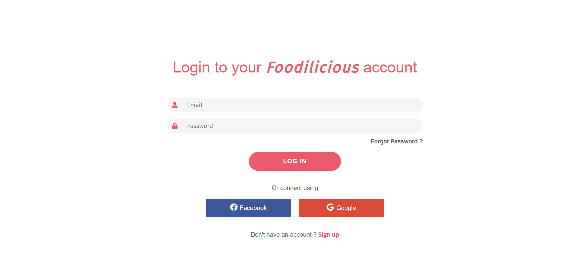
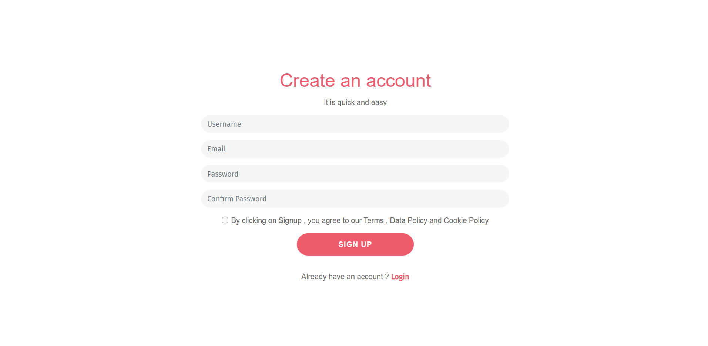
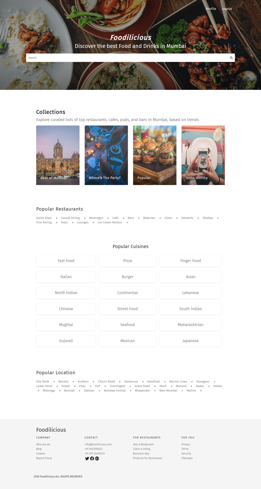
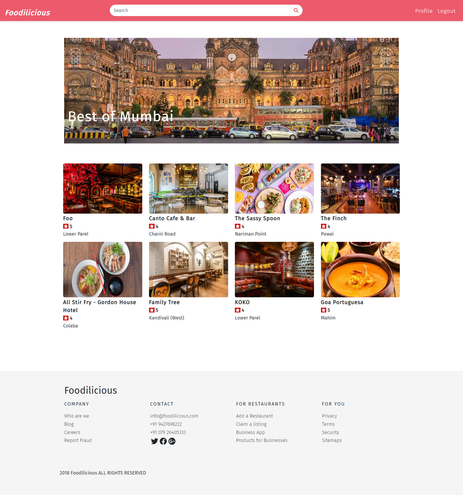
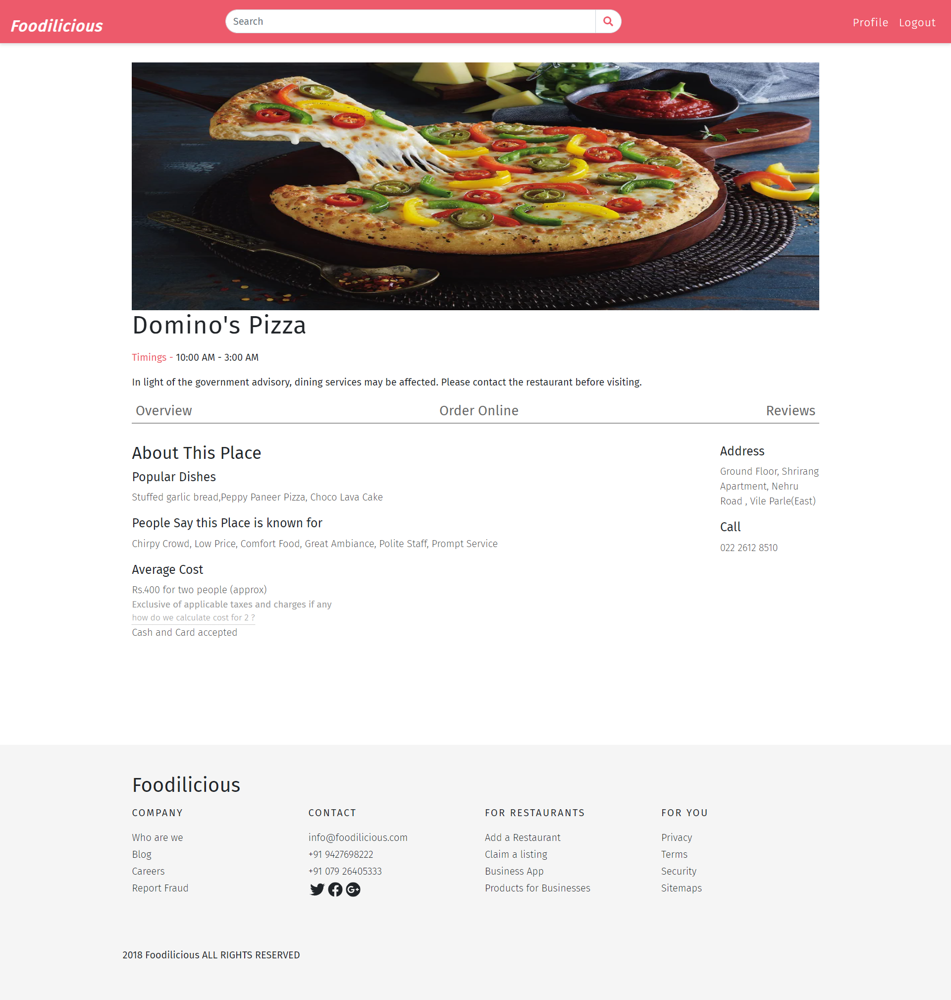
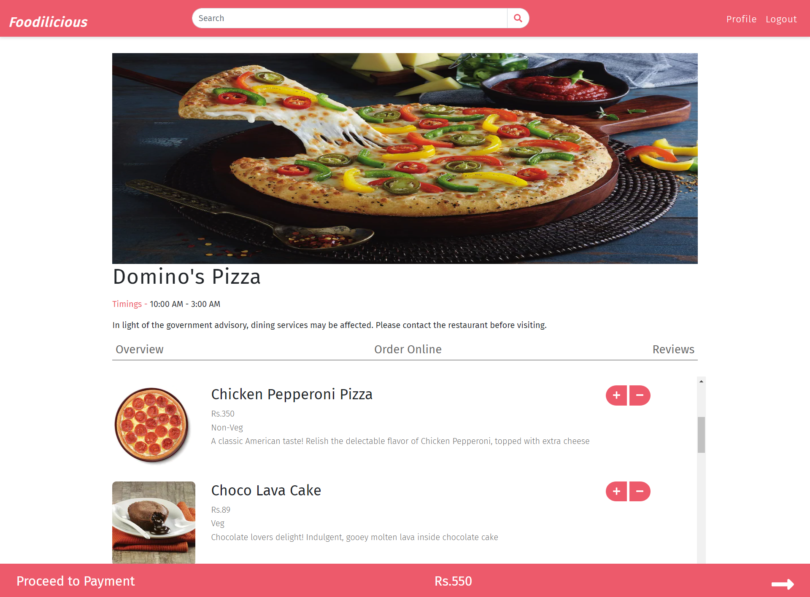
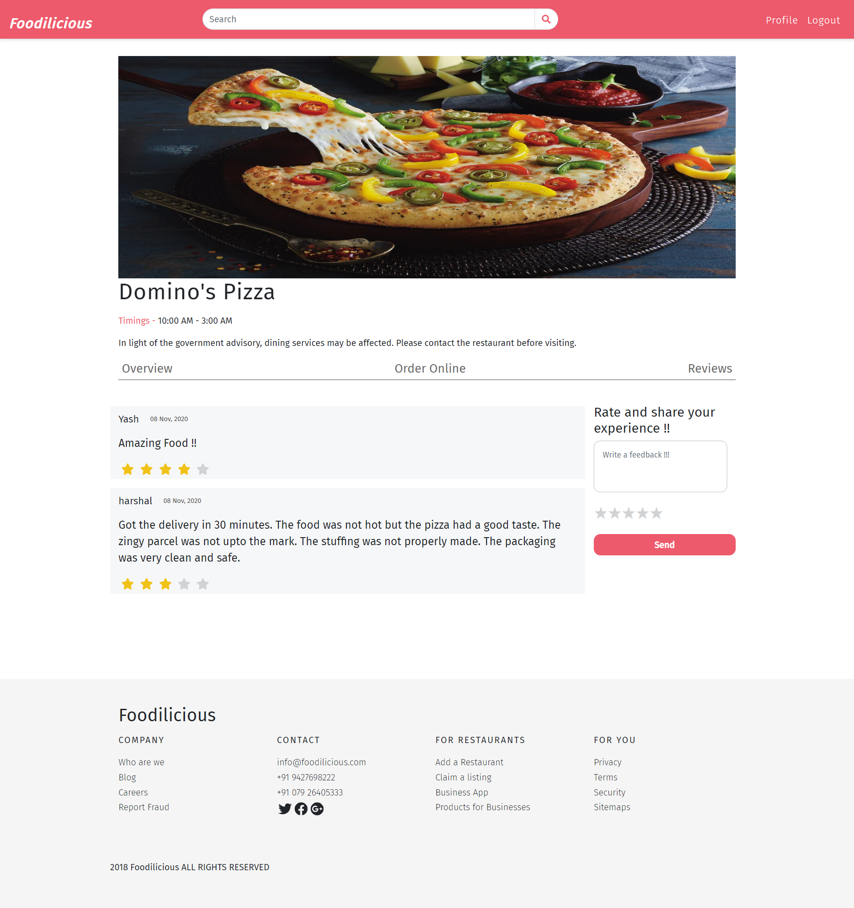
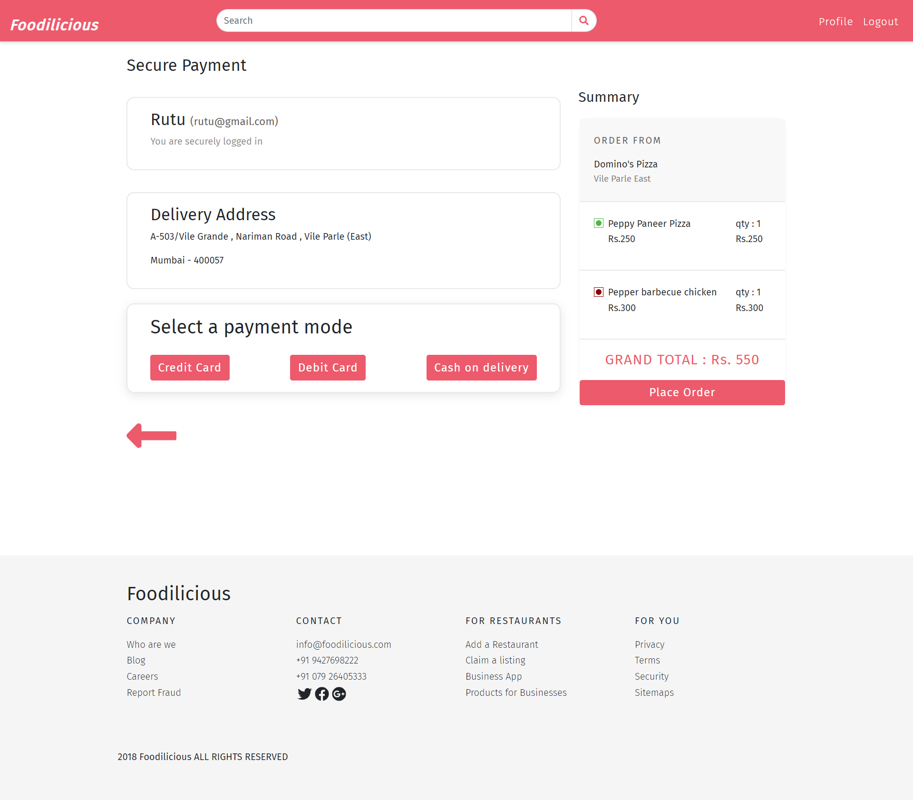
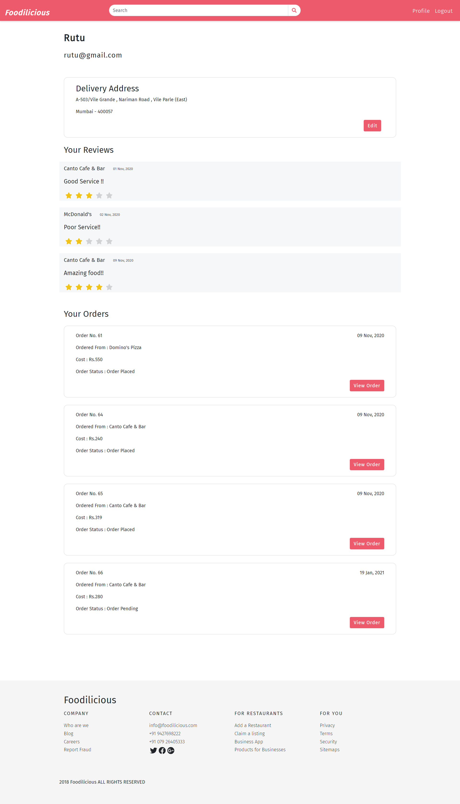

<h3 align="center"></h3>
<h3 align="center">WD-DBMS Semester-V Mini Project</h3>
<h4>Team</h5>
<ul>
  <li>Rutu Gaglani</li>
  <li>Saurav Tiwari</li>
  <li>Sharayu Bokde</li>
</ul>
 

Food Delivery Web Application - Foodilicious, is a one stop destination for ordering food online and know about every restaurant. We have created a platform to provide a
collaboration space for the restaurants where they can share their menus that they have for various cuisines with the customers. We have created a platform for customers as well so that they can directly login and have their own profile and get recommendations accordingly and avail exciting offers on the website. A review section has been created so that the customers can have their own space to share the experiences of the various restaurants that they have tried. Our main goal was to give every restaurant a safe haven where everyone of the customers and restaurants are in a closed knit relation, reducing latency and preventing the usage of several social media means which can easily get confusing, thus ensuring customers never miss any update.

 
<h3>Software Requirements: </h3>

<ul>
  <li>Operating System: Windows</li>
  <li>Programming language: JavaScript and SQL</li>
  <li>Front-End Framework: React,Redux,Bootstrap</li>
  <li>Back-End Framework: NodeJS</li>
  <li>Database Framework: MySQL Workbench</li>
  <li>Database: MySQL</li>
  <li>Front-End: </li>
  <ul>
    <li>HTML</li>
    <li>CSS</li>
    <li>Javascript</li>
  </ul>
</ul>
 

<h4>Pages :</h4>
<table>
  <tr>
      <th>Name</th>
      <th>Description</th>
   </tr>
     
   <tr>
      <td><b>Home</b></td>
      <td>
This page provides concise information about the features of the website. The homepage displays all collections, popular restaurants, popular cuisines and popular locations. We can also search the best foods and drinks using the Search bar. User needs to login into their accounts in order to place an order.
</td>
   </tr>
  <tr>
      <td><b>Collections</b></td>
      <td>
This page provides category wise list of the restaurants. The categories include collections, popular restaurants, popular cuisines and popular locations. We can choose from a wide range of restaurants, cafes from a particular category. 
</td>
   </tr>
  <tr>
      <td><b>Restaurant Overview page</b></td>
      <td>
This page provides information of a Restaurant like the timings when it will be open, its address, mobile no. of restaurant, its popular dishes, what people know and like about the restaurant and average cost for 2 people.
</td>
   </tr>
  <tr>
      <td><b>Order Online page</b></td>
      <td>
This page provides the menu of Restaurant. We can choose from a variety of options. The minimum cost to place an order is Rs. 100. You can click on + button to add multiple items in the cart and – button to remove an item from cart. The total cost will be displayed below and it will be updated after every addition or removal of items from the cart. 
</td>
   </tr>
  <tr>
      <td><b>Payment</b></td>
      <td>
We land on this page only after we click on the proceed to place order button in order online page. This page gives us the detailed list of the items from cart which we wish to order along with its quantity, price and total cost. We can also edit the address for the order to be delivered. Then after confirming the address we get the option of selecting from 3 different payment modes which are Debit Card, Credit Card and Cash on Delivery. After filling the details we can place the order.  

    </td>
   </tr>
  <tr>
      <td><b>Review Page</b></td>
      <td>
This page of a restaurant displays all the reviews of the customers who all visited this restaurant. We can also add a review based on our experience at restaurant, its ambience etc. We can also rate the restaurant while adding review.  
</td>
   </tr>
  <tr>
      <td><b>Profile Page</b></td>
      <td>
TThe profile page of a user displays user’s information like username, email address, delivery address, all the reviews written by the user and user’s past orders details etc. If a user forgot to place the order ie if the status of order is pending then on clicking that order, he/she will be directed to the payment page of the restaurant. Hence he can complete the payment process and the order status will be changed to ‘Order Placed’. If the order is already placed, the user can view the details of the order like list of items, total cost and the date.
</td>
   </tr>
  
</table>

<h4>Images:</h4>
<b>Login</b>
<h3 align="center"></h3>
<b>Signup</b>
<h3 align="center"></h3>
<b>Home Page</b>
<h3 align="center"></h3>

<b>Collection's Page</b>

<h3 align="center"></h3>

<b>Restaurant Overview page</b>

<h3 align="center"></h3>

<b>Order Online page</b>

<h3 align="center"></h3>

<b>Restaurant Review Page</b>

<h3 align="center"></h3>

<b>Payment</b>

<h3 align="center"></h3>

<b>Profile</b>

<h3 align="center"></h3>
